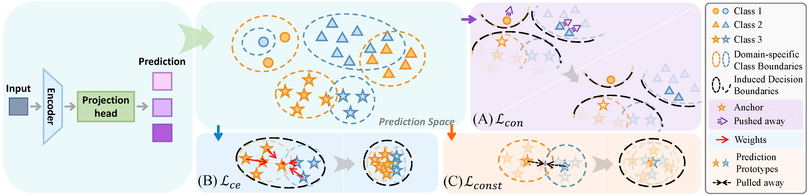

# Negatives-Dominant Contrastive Learning for Generalization in Imbalanced Domains

[](https://icml.cc/)
[](https://pytorch.org/)

This repository contains the official PyTorch implementation of **Negatives-Dominant Contrastive Learning for Generalization in Imbalanced Domains**, accepted at ICML 2026.


## Overview

NDCL targets imbalanced domain generalization under both domain and label shifts. Unlike existing IDG methods that mainly rely on reweighting or data augmentation for minority classes, we observe that both shifts deteriorate the decision boundary from different perspectives. Guided by our theoretical analysis, NDCL aims to explicitly reshape the decision boundary for generalization.

Our NDCL introduces a negatives-dominant contrastive loss (A), which reformulates the negative sampling strategy in InfoNCE to naturally suit imbalanced learning. It is further combined with intra-class reweighting (B) to tighten class boundaries and class-wise predictive prototype alignment (C) to enforce prediction consistency across domains.




## Quick start

Training:
```bash
# run experimental trials
# --type "setting name"
python3 -u sweep_im.py launch --data_dir /path/your/dataset --algorithm NDCL \
                              --dataset PACS --output_dir ./logs/TotalHeavyTail \
                              --command_launcher local --type TotalHeavyTail
```

Create a custom setting from script:
```python
# generate an sample for the TotalHeavyTail setting (idg_generate.py)
# to generate a new configuration, you may override the Generator class 
# to implement custom control logic.
generator = TotalHeavyTail(num_valid, percent_test, c=heavytail_paramenter)
stats = main(dataset, num_valid, thred_many, thred_few, generator, file=filestream)
```

The layout is:
```text
src/
├── lib/
├── train_im.py
├── sweep_im.py
├── ...
└── stats/
    ├── PACS/
    │   └── TotalHeavyTail.py
    └── Name of Dataset/
        ├── Custom Setting1.py
        └── Custom Setting2.py
```

## Citation

If you find this work useful in your research, please cite:

```bibtex
@inproceedings{cao2026negatives,
    title     = {Negatives-Dominant Contrastive Learning for Imbalanced Domain Generalization},
    author    = {Cao, Meng and Liu, Jiexi and Chen, Songcan},
    booktitle = {Proceedings of the 43rd International Conference on Machine Learning (ICML)},
    year      = {2026}
}
```


# Acknowledgement

This implementation is built upon the **DomainBed** framework and the **MDLT** repository.

[DomainBed](https://github.com/facebookresearch/DomainBed)  
[Multi-Domain Long-Tailed Recognition](https://github.com/YyzHarry/multi-domain-imbalance)

## Contact

For questions or issues, please open an issue on GitHub or contact the authors.

